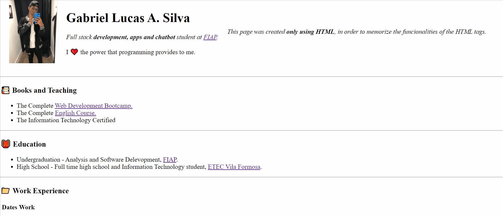

<h1 align="center">
  My First Personal WebSite
</h1>

  This WebSite was created in order to practice and memorize my new HTML skills, which I have been
  learned at the <a href="https://www.udemy.com/course/the-complete-web-development-bootcamp/?referralCode=F2958B9D9447BDFC8244" target="_blank">Web Development Bootcamp</a> during my vacation.

  

 

<h2>
  💻Technologies
</h2>

  This simple website was developed only using:

<ul>
  <li>HTML</li>
</ul>
